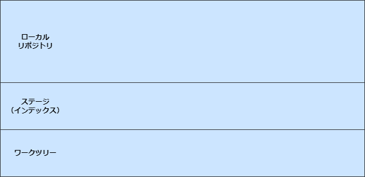

<style type="text/css">
  .reveal h1,
  .reveal h2,
  .reveal h3,
  .reveal h4,
  .reveal h5,
  .reveal h6 {
    text-transform: none;
  }
</style>

---

# Git

仕組みと修正コマンド

---

## 目次

1. Git の仕組み
   1. ソースコード管理
   2. 3つのエリア
2. 修正コマンド
   1. git revert
   2. git reset

---

## 1.Git の仕組み

---

## 1-1.ソースコード管理

--

## Git はスナップショット？差分？

--

### Git はデータをスナップショット<br>として保存する

note:git graph などで差分を確認していると、差分だけ登録しているのかなと思ってしまいました

--

### スナップショットで<br>保存するメリット

- 操作の高速化
  - ブランチをきったりマージする際に、差分計算が不要
- 堅牢なデータ管理の実現
  - コミット同士が疎結合になる
  - 前のコミットが消えてしまっているからあるコミットが復元できない、ということが起きない

--

### スナップショットはどのように管理されているのか？

ディレクトリ構造を反映した木構造とハッシュ値で管理されている

--

### ハッシュ値

ソースコードその他の管理対象は、ファイル中身に（ほぼ）固有の数値（ハッシュ値）で管理される

```
# ファイルの中身が「Hello, world!」になっているgreetingファイルを作成
$ echo 'Hello, world!' > greeting
 
# greetingのハッシュIDを表示
$ git hash-object greeting
af5626b4a114abcb82d63db7c8082c3c4756e51b
```

--

### 木構造

```
# git add することで圧縮ファイルを作成
$ git add greeting

# .git以下のファイル構造を表示(以下は表示の一部を抜粋)
$ tree .git
.git
├─ objects
   ├─ af
      └─ 5626b4a114abcb82d63db7c8082c3c4756e51b

# コミットする
$ git commit -m 'add greeting'
```

先程確認したハッシュIDのうち、先頭2文字がディレクトリ名として、残りがファイル名として保存されている

--

### 


---

## 1-2.3つのエリア

--

### ローカルの３つのエリア



ローカルリポジトリの中身 .git

--

### Git が変更履歴を保存するときに<br>記録しているスナップショット

- 圧縮ファイル
- ツリーファイル
- コミットファイル

--

# ?

note:私は正直コミットの内容が登録されている、以外のことはイメージしていませんでした

--

### コミットまでの流れを<br>イメージで確認

1. index.html を作成
2. git add
3. git commit

note:厳密に全ての処理を網羅できていない説明です

--

### git add


1. index.html のファイルの中身を圧縮したファイルをローカルリポジトリに保存
2. ファイル名「index.html」と、内容にあたる「圧縮ファイル」をマッピングした情報をインデックスに追加

note:【1 の捕捉】このとき保存されるファイル名は、ファイル の 中身 に ヘッダ を 付け加え た文字 列 を ハッシュ 関数で 暗号 化 し た 文字 列 になります

--

### git commit


1. インデックスのファイル構成を元にツリーファイルを新規作成
2. コミットファイルの作成

note:【2 の捕捉】コミットファイル内の情報は、ツリーファイルの名前、（変更履歴をたどれるように、）直前のコミットがあれば親コミットの情報、作成者の名前とメルアドレス、コミットしたときの日付時刻、コミットメッセージなどです。このため、コミットファイルからはその時のファイルの状態と、誰がいつ何のために変更したのかが分かります【言わなくていいけどメモ】作成者情報は Git 初期設定登録時のもの

--

### git コマンドは以下の Git オブジェクトに対して操作を行っている

- 圧縮ファイル
- ツリーファイル
- コミットファイル

note:ということを意識してコマンドの処理を捉えていくと理解に役立つそうです。

---

## 2.修正コマンド

---

## 2-1.git revert

--

### イメージで理解


- 1 つ以上の既存のコミットがある場合、関連するパッチが導入した変更を元に戻し、それらを記録するいくつかの新しいコミットを記録する
- これには、作業ツリーがクリーンである必要がある

note:公式より

--

### git revertコマンド

使い方
```
$ git revert <対象のcommit>
```
例
```
# 現在のコミットの打ち消しコミットを作成
$ git revert
$ git revert HEAD

# commitのハッシュ値を指定して打ち消しコミットを作成
$ git revert dd9f2940

# 過去２つ前のコミットの打ち消しコミットを作成
$ git revert HEAD~2

# 範囲指定して打ち消しコミットを作成
$ git revert master~5..master~2
```

note:ハッシュ値の指定について、Githubの中の人がリポジトリ内なら4桁でも検索可能だとお話している記事がありました。プロジェクトの大きさによって、特定に必要なハッシュ値はもっと大きくなりますが、キングでは今のところ何桁でした

--

### ⚠️マージコミットの打ち消しには<br>気を付けろ！

--

### マージコミットに対して普通にrevertすると…

```
$ git revert b7d7ef1
error: commit b7d7ef182809ce32ea1251e90dd75de5932d9518 is a merge but no -m option was given.
fatal: revert failed
```

「-m オプションが指定されていません」😤

--

### なぜマージコミットは通常の<br>コマンドでは実行できないのか？

--

### マージコミットは<br>parent(親)を２つ持つ！


- 問題点：親コミットが複数あるとどの歴史が<br>「正（mainline）」か分からないため、<br>Gitが実行に移れない
- 解決策：親を指定する

note:実際のVSCODEを立ち上げて、Synergyとかでマージされてるブランチを確認すれば、親コミットが２つあることがわかる

--

### 親の確認

```sh
# 使い方
$ git show <打ち消したいcommit>
# 例
$ git show b7d7ef182809ce32ea1251e90dd75de5932d9518
commit b7d7ef182809ce32ea1251e90dd75de5932d9518 (HEAD -> master)
Merge: 0ecfab2 ab14cfe
Author: monaka1673 <ukkari9683@outlook.jp>
Date:   Sun Oct 16 11:42:01 2022 +0900

    Merge branch 'topic'

```
  
親番号1：0ecfab2  
親番号2：ab14cfe

note:https://qiita.com/shyamahira/items/22c4a2423c21c288cb8e

--

### 親の確認

git graph でも確認可能

--

### マージコミットの打ち消し

使い方
```
$ git revert -m <親番号> <打ち消したいcommit>
```
例
```
$ git revert -m 1 b7d7ef
```

note:https://www-creators.com/archives/2111
note:https://www-creators.com/git-command/git-revert

--

### マージコミットの打ち消し

git graph から操作すると、親の指定を求められる

note:最近私の手違いで足立さんのコミットを削除してしまいました。その原因ですが、リバートの際に誤った親を選択してしまった可能性があります。今回勉強したことを、今後の反省として生かしていきたいと思います。

---

## 2-2.git reset

--

### 例）以下のようなリポジトリが<br>あったとします


--

### git reset --soft


--

### git reset --mixed


--

### git reset --hard


--

### resetの取消

```
# HEAD の移動履歴一覧を表示
$ git reflog

# 特定の時点までファイルを巻き戻す（n:戻りたい地点の数字）
$ git reset --hard HEAD@{n}
```

note:【参考】https://www.r-staffing.co.jp/engineer/entry/20191227_1

---

## おまけ

--

### git restore

使い方
```
$ git restore <復元場所の指定> <file>
```
例
```
# ワークツリー(git add前)の変更取消
$ git restore --worktree <file>
$ git restore <file>

# ステージ(git add後)の変更取消
$ git restore --staged <file>  
```

--

### git restore

- ワークツリーとステージ両方の変更取消
  - --source=<tree>
    - 指定されたツリーのコンテンツを使用してワークツリーファイルを復元
    - 指定しなかった場合
      - --stagedが指定されている場合：HEAD
      - 上記以外の場合：インデックスから内容が復元される

```
$ git restore --source=HEAD --staged --worktree <file> 
```

--

### Gitのファイル管理が分かる<br>コマンド

```
# Gitオブジェクトの中身の確認
$ git cat-file -p <オブジェクト名>

# .git配下のファイル構造を表示
$ tree .git
```

note:Gitオブジェクトの中身を確認していくと、treeオブジェクトとblobオブジェクトがでてきます。ふんわり説明をすると、treeオブジェクトがフォルダでblobオブジェクトがファイルに相当していて、gitがツリーファイルをどんなふうに管理しているのかが分かります。

---

## おわり

ありがとうございました 🙉

note:コマンドを調べたら動かせるけど、どんな処理がされているのかよく分かっていなかった部分が非常に多かったので、Gitの操作に対して不安を持っていました。まだまだ不安はありますが、今回勉強したことを今後の理解に役立てていきたいです。
