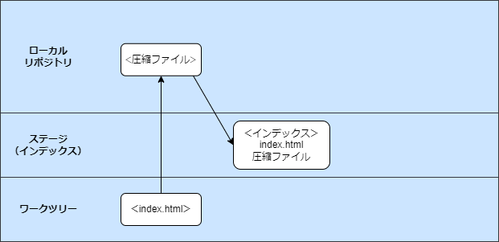
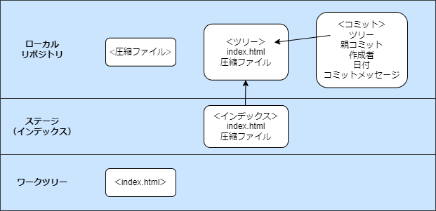

<style type="text/css">
  .reveal h1,
  .reveal h2,
  .reveal h3,
  .reveal h4,
  .reveal h5,
  .reveal h6 {
    text-transform: none;
  }
</style>

---

# Git

仕組みと修正コマンド

---

## 目次

1. Git の仕組み
   1. データの保存方法
   2. データ管理
2. 修正コマンド
   1. git restore
   2. git reset

---

## 1.Git の仕組み

---

## 1-1.データの保存方法

このかたまりあとで消す

--

## Git はスナップショット？差分？

--

### Git はデータをスナップショット<br>として保存する

note:git graph などで差分を確認していると、差分だけ登録しているのかなと思ってしまいました

--

### スナップショットで<br>保存するメリット

- 操作の高速化
  - ブランチをきったりマージする際に、差分計算が不要
- 堅牢なデータ管理の実現
  - コミット同士が疎結合になる
  - 前のコミットが消えてしまっているからあるコミットが復元できない、ということが起きない

---

## 1-1.ソースコード管理

--

### 管理方法

- 管理対象はファイルごとに圧縮され、ファイル中身に（ほぼ）固有の数値（ハッシュ値）で管理される

このへんどうまとめようかな
https://kftamang.github.io/post/git/

---

## 1-2.データ管理

--

### ローカルの３つのエリア


- ローカルリポジトリの中身
  - .git

--

### Git が変更履歴を保存するときに<br>記録しているスナップショット

- 圧縮ファイル
- ツリーファイル
- コミットファイル

--

# ?

note:私は正直コミットの内容が登録されている、以外のことはイメージしていませんでした

--

### コミットまでの流れをイメージで確認

1. index.html を作成
2. git add
3. git commit

note:厳密に全ての処理を網羅できていない説明です

--

### git add



1. index.html のファイルの中身を圧縮したファイルをローカルリポジトリに保存
2. ファイル名「index.html」と、内容にあたる「圧縮ファイル」をマッピングした情報をインデックスに追加

note:【1 の捕捉】このとき保存されるファイル名は、ファイル の 中身 に ヘッダ を 付け加え た文字 列 を ハッシュ 関数で 暗号 化 し た 文字 列 になります

--

### git commit



1. インデックスのファイル構成を元にツリーファイルを新規作成
2. コミットファイルの作成

note:【2 の捕捉】コミットファイル内の情報は、ツリーファイルの名前、（変更履歴をたどれるように、）直前のコミットがあれば親コミットの情報、作成者の名前とメルアドレス、コミットしたときの日付時刻、コミットメッセージなどです。このため、コミットファイルからはその時のファイルの状態と、誰がいつ何のために変更したのかが分かります【言わなくていいけどメモ】作成者情報は Git 初期設定登録時のもの

--

### git コマンドは３つの Git オブジェクトに対して操作を行っている

- 圧縮ファイル
- ツリーファイル
- コミットファイル

note:ということを意識してコマンドの処理を捉えていくと理解に役立つそうです。

---

## 2.修正コマンド

---

## 2-1.git revert

--

### イメージで理解


--

使い方

```sh
$ git
```

---

## 2-2.git reset


--

resetのとりけし

https://www.r-staffing.co.jp/engineer/entry/20191227_1

---

## 2-2.git rebase


---

## おまけ

--

- git add前(ステージ前)の変更取消
  - --worktree
    - 復元場所の指定。ワークツリーの復元
    - 指定しなかった場合のデフォルト

```
$ git restore --worktree <file>
$ git restore <file>
```

- git add後(ステージ後)の変更取消
  - --staged
    - 復元場所の指定。インデックスの復元

```
$ git restore --staged <file>    
```

--

- git add前後の両方の変更取消
  - --source=<tree>
    - 指定されたツリーのコンテンツを使用してワークツリーファイルを復元
    - 指定しなかった場合
      - --stagedが指定されている場合：HEAD
      - 上記以外の場合：インデックスから内容が復元される

```
$ git restore --source=HEAD --staged --worktree <file> 
```

---

## 終わり

ありがとうございました 🙉
